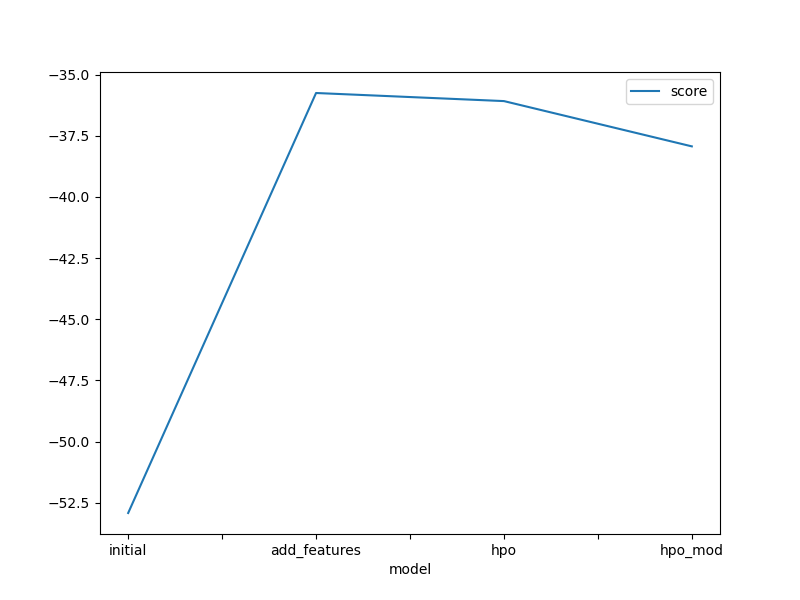
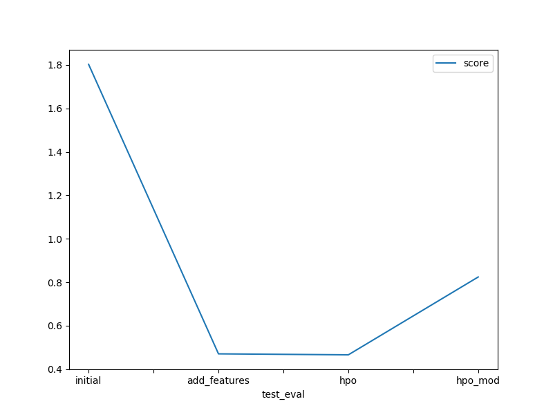

# Report: Predict Bike Sharing Demand with AutoGluon Solution
#### Maryrose "Shandy" Roque

## Initial Training
### What did you realize when you tried to submit your predictions? What changes were needed to the output of the predictor to submit your results?
There were no necessary changes in the output of my predictor. All of them were positive and there were no transformations needed to enable their submission to Kaggle.

### What was the top ranked model that performed?
The top model was the Weighted Ensemble with a level of 3. It had an RMSE of -52.921245. This was followed by the Random Forest at Level 2 and the Extra Trees at Level 2. It is possible that the reason for this is the presence of both discrete and continuous data in the dataset.

## Exploratory data analysis and feature creation
### What did the exploratory analysis find and how did you add additional features?
It showed that the date-time graphy did not really provide as much insights as the additional date-time features that were created. The yearly, monthly, daily, and hourly graphs showed the pattern of bicycle demand. The hourly and monthly demand, which were quite consistent in both train and test data, should be looked into further as they clearly show the peak days and hours of bike demand. Looking into these patterns may mean adding additional bicycles to support these peak times and increase rentals.  

### How much better did your model preform after adding additional features and why do you think that is?
Changing the datatype of season and weather to category, adding the additional features and removing the initial datetime column made a lot of difference in the performance of the model, reducing the score from 1.8 to 0.47 which is roughly 73.8% lower.

## Hyper parameter tuning
### How much better did your model preform after trying different hyper parameters?
It was initially expected that the model would perform much better with the adjustment of the hyperparameters. The first iteration, which involved the tuning of autogluon hyperparameters, performed marginally better by lowering the score by 0.01. It was, however, very disappointing to see that the tuning of model hyperparameters did not work out as well as expected.

Perhaps it would have been better to analyze these models individually using a random search cross validation or grid search validation techniques. It was quite evident that the machine struggled due to insufficient memory during the process, which may have affected it's performance. 

Another insight would be changing the split as it seems that the dataset was a time-series data. It would be interesting to see what the prediction if a time-series algorithm was used. 

### If you were given more time with this dataset, where do you think you would spend more time?
With more time, the next steps should be the hyperparameter tuning of the top performing models. As they are mostly ensembles, it would be a good idea to compute for the feature importance. 

### Create a table with the models you ran, the hyperparameters modified, and the kaggle score.

### Create a line plot showing the top model score for the three (or more) training runs during the project.

### Create a line plot showing the top kaggle score for the three (or more) prediction submissions during the project.

## Summary

The dataset, which consisted of time, date, and weather values, showed the pattern of bicycle demand. A look at the distribution of the data, however, showed that the distribution of the initial datetime column did not provide much insights as the new features that were added by extracting the year, month, day, and hour. With the removal of this datetime column and the addition of the new features, the performance of the algorithm improved by almost 73.8%. 

Hyperparameter tuning, however, did not make much of a difference in the accuracy of the data, possibly because of the limited memory size or the fact that it may have led to overfitting. 
